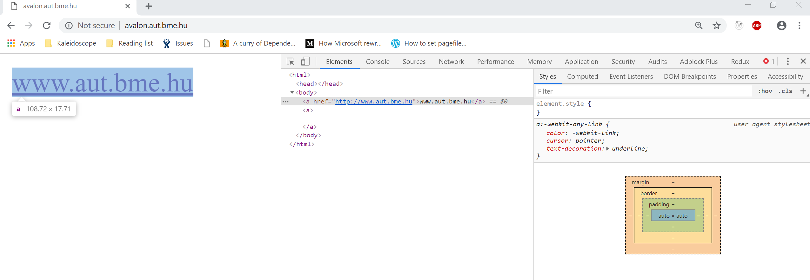

# Multiplatform fejlesztés Javascript alapon

## Bevezetés

Az Interneten a web működését olyan alapvető technológiák és szabványok teszik lehetővé, mint a HTML (Hypertext Markup Language), a CSS (Cascading Style Sheets), a HTTP (HyperText Transfer Langauge) illetve a JavaScript. 

A HTML egy jelölő nyelv, amivel elrendezhetjük a dokumentumok különböző tartalmi egységeit és testre szabhatjuk azok megjelenítését. Az egyes dokumentumokat webszerverek tárolják, amelyek biztosítják a dokumentumok elérését. A dokumentumok címe (URL) több részből áll. Tekintsük például a http://www.example.com/index.html webcímet.
* A www.example.com a webszerver hálózati címe.
* A /index.html azonosítja a dokumentumot a szerveren. Látszik, hogy a dokumentumnak van egy neve és egy szerveren belüli elérési útvonala. Amikor egy címet beírunk egy böngésző címsorába, akkor a böngésző elküld egy kérést a webszervernek, amelyre válaszul megkapja a kért dokumentumot.
* A http:// előtag jelzi, hogy a böngésző és a webszerver között milyen alkalmazási rétegbeli protokollal történik az adat lekérése.

A böngésző egy olyan alkalmazás, amely a HTML szabványt ismerve képes megjeleníteni a HTML nyelven leírt tartalmat. A HTML dokumentumok tartalmazhatnak (hiper)linkeket, amelyek más dokumentumra mutató hivatkozások. A dokumentumok valójában nem csak HTML fájlok, hanem más állományok (például kép fájl) is lehetnek.

### Webalkalmazások
A világháló eddig leírt alapvető működése az elmúlt évtizedekben nagymértékben fejlődött. A
dokumentumok ma már nem csak statikus tartalmak és a webszerver feladata sem kizárólag csak
annyi, hogy felolvas egy HTML dokumentumot vagy képfájlt és azt visszaadja. Egy összetett
webalkalmazás esetén is egy URL-en keresztül fordulunk egy webszerverhez. A webszerver azonban
dinamikusan is előállíthatja a kért választ a böngészőnek. Ez azt jelenti, hogy a webszerveren a kérés
hatására lefut egy program, amely a bejövő paraméterek (például honnak küldték a kérést, milyen
felhasználó küldte stb.) függvényében más és más kimenetet állít elő.  


### JavaScript

A web fejlődésének egyik fontos mozgatórugója a böngészők hatalmas fejlődése volt. A böngészők
önállóan is képesek komplex programokat futtatni, amelyeket JavaScript nyelven lehet megírni.
Ilyenkor tehát a program forráskódjának kell eljutnia a böngészőhöz, amely azt végrehajtja. A
forráskódot beágyazhatjuk a HTML fájlba, vagy önálló dokumentumként is lekérhetjük. Már említettük,
hogy a böngésző képes a HTML tartalmat megjeleníteni. A JavaScript nyelven írt programok képesek a
böngészőben futva módosítani a HTML tartalmat. Például írhatunk olyan JavaScript kódot, amelynek a
segítségével hozzáadhatunk egy új sort egy táblázathoz, vagy elrejthetünk egy gombot. A módosított
HTML tartalom alapján a böngésző frissíti a megjelenítést.

### Összefoglalás
A weboldalak tehát ma már nem csak egyszerű HTML dokumentumok. A fenti technológiák annyira fejlettek, hogy különböző készülékek (mobiltelefonok, táblagépek, asztali számítógépek) böngészőiben, vagy akár azokon kívül önálló alkalmazásként futó komplex alkalmazásokat készíthetünk velük. A JavaScript pedig egyszerű szkriptnyelvből teljes értékű, akár szerveroldalon is használható programozási nyelvvé vált (ld. [NodeJS](https://nodejs.org/en/)). 

Az alábbiakban áttekintjük, hogy a webes technológiák honnan és hova fejődtek és hogyan teszik lehetővé a valódi multiplatform fejlesztést.

## HyperText Transfer Protocol (HTTP)

Az egyik fontos szabvány, amely a világháló működését biztosítja a Hypertext Transfer Protocol
(HTTP), amely egy kliens-szerver elven működő információátviteli és kollaborációs protokoll. Ez azt
jelenti, hogy egy kliens HTTP kérést küldhet a szervernek megjelölve, hogy milyen adaton milyen
műveletet akar végrehajtani. A szerver erre a kérésre választ küld és természetesen végrehajtja az
adott műveletet. A leggyakoribb művelet a lekérés, ilyenkor a szerver egyszerűen visszaadja a
megcímzett adatot. Ezeket az adatokat erőforrásoknak (vagy dokumentumoknak) nevezzük. 

A HTTP kliensek tipikusan a böngészők. Ha a címsorba beírunk egy címet, akkor a megfelelő weboldalt
lekérik egy webszervertől. Ebben az esetben a webszerver a HTTP szerver, az elküldött kérés peding egy HTTP
kérés. A kérés GET típusú, azaz a lekérés műveletet tartalmazza, továbbá a lekért weboldal címét,
amely a megcímzett erőforrás azonosítója. A válasz üzenet a GET műveletre visszaadja a kért
dokumentumot. A HTTP-t eredetileg a világhálón a weboldalak elérésére fejlesztették ki, de ma már
nem csak a webszerverek és böngészők közötti kommunikációban van fontos szerepük.

A protokoll maga azt definiálja, hogyan néz ki egy HTTP kérés, illetve válasz üzenet, azaz hogyan tudjuk megfogalmazni azt, hogy milyen műveletet akarunk elvégezni, mi az aktuális cím és hogyan tudunk még egyéb paramétereket elküldeni. 

A HTTP protokoll egyik fontos tulajdonsága, hogy állapotmentes. Ez azt jelenti, hogy a szerver nem
tárolja el a kliensek által küldött korábbi kéréseket és ez alapján nem módosul a visszaadott adat. 

### Tesztelés böngészőben

A modern böngészők beépítve tartalmaznak eszközöket, amelyekkel a webfejlesztőket és tesztelőket
támogatják, ezeket fejlesztői eszközöknek (developer tools) nevezzük. (Ezeket a böngészőkben
általában az F12 billentyűvel lehet megjeleníteni.) A fejlesztői eszközök sok egyéb mellett tartalmaznak
egy funkciót, amellyel a böngészőből kimenő és a bejövő üzeneteket lehet követni és megjeleníteni.

### HTTP metódusok

A HTTP kérések specifikálják, hogy a megcímzett erőforráson milyen műveletet akarunk végrehajtani.
A következő táblázatban láthatók az egyes metódusok és az általuk megcímzett műveletek.

* *A GET kéréssel le tudunk kérni egy erőforrást a szerverről. A válasz tartalmazza a
megcímzett erőforrást, miközben a kérés nem változtatja meg a szerver állapotát, azaz
a kérés kiszolgálásának nincsen mellékhatása.
* A HEAD kérés hasonló a GET-hez, azzal a különbséggel, hogy a szerver válaszában nem
szerepel semmi az üzenet törzsében, vagyis csak a GET-re adandó válasszal azonos
üzenet címsorát és fejléc részét küldi el.
* POST üzenet segítségével tudunk új tartalmat küldeni a szervernek.
* A PUT üzenet segítségével egy erőforrást tudunk újjal helyettesíteni, vagyis frissíteni.
DELETE A DELETE üzenettel tudunk erőforrást törölni. 

A világháló működése során a böngészők nem teljes mértékben az eredeti koncepció szerint használják
a HTTP metódusokat. Ugyanis az erőforrások ebben az esetben a HTML dokumentumok, amiket nem
akarunk módosítani böngészőn keresztül. A különböző weboldalakra történő navigálások során
szerveroldalon futó programok generálják gyakran a szöveget attól függően, hogy korábban milyen
adatokat küldtünk be, így az sem teljesül, hogy a GET kéréseknek nem lehet semmilyen mellékhatása
sem. A böngészők tipikusan a GET és POST metódusokat használják. GET kéréseket generálnak egy
oldal megnyitásakor és POST kéréseket a különböző űrlapok kitöltésekor. 

A HTTP metódusok eredeti jelentése sokkal nagyobb jelentőséggel bír ún. WEB API-k használatakor.
Tegyük fel, hogy termékek adatait tároljuk egy szerveren és szeretnénk hálózaton keresztül valamilyen
programozói interfészt (API-t) biztosítani a szerveren tárolt adatok (erőforrások) szerkesztéséhez. A
szerkesztés során szeretnénk lekérni termékeket az adatbázisból, létező termékeket módosítani,
illetve új termékeket is beszúrni. Kézenfekvő megoldás lehet, hogy a szerveroldalon egy webszervert
működtessünk, a kliensalkalmazásokból pedig HTTP kéréseket küldjünk. Ennek előnye, hogy mind a
szerver-, mind a kliensoldal programozásához sok programozási környezetben rendelkezésre állnak a
megfelelő segédkönyvtárak. Látható, hogy ebben az esetben, amennyiben egy-egy terméket egy-egy
erőforrásnak tekintünk, valóban ki tudjuk használni a HTTP metódusok eredeti jelentését és ez a
módszer lehetővé teszi hatékony API-k készítését. Az ilyen elven működő kommunikáló architektúrát
RESTful (REST = REpresentational State Transfer) architektúrának nevezzük. 

## HTML alapok

### Egy kis történelem
A HTML gyökerei a nyolcvanas évek végére nyúlnak vissza, amikor a svájci CERN1-ben dolgozó fizikus,
Tim Berners-Lee azzal a problémával szembesült, hogy a korabeli dokumentum formátumok nem
megfelelőek a fizikusok által előállított kutatási eredmények megjelenítésére. Az egyik fájó pont a
képek, ábrák, illusztrációk és általánosságban a gazdag formázási lehetőségek hiánya volt. A másik
hiányosság az volt, hogy bár a kutatási eredmények általában egymásra épültek, kapcsolódtak
egymáshoz, ezt a relációt az akkori fájlformátumok nem tudták explicit módon kezelni. Ezen problémák
megoldására Tim Berners-Lee két ötlettel állt elő, melyek a mai napig meghatározzák a HTML nyelvet:
* A dokumentum ne csak egyszerű szöveg legyen, hanem a tartalmat hordozó részt lássuk el
címkékkel, amelyek kiegészítő információkat (metaadatokat) kapcsolnak a szöveghez. Hasonló
célú egyszerűbb jelöléseket a nyomdatechnikában már korábban is használtak (pl. egyszeres
aláhúzás: dőlt, kettős aláhúzás: félkövér betű), itt a nagy újdonság a formalizmus és
címkekészlet megalkotása volt, így jött létre a HTML mint jelölőnyelv (markup language).
* A dokumentumok „mutassanak túl” önmagukon, azaz olyan hiperszövegeket (hypertext)
tartalmazzanak, amelyek egy másik dokumentum bármely részletére hivatkozhatnak. Ez az,
amit ma úgy ismerünk, hogy egy weboldalon r

### XML

A HTML segítségével kezdetben statikus weboldalakat lehetett leírni.  Egy HTML dokumentum egy szöveges fájl, amelynek megértéséhez ismerjük meg először az XML (eXtensible Markup Language) nyelvet:

Egy XML dokumentum, egy szöveges fájl, amely úgynevezett *tag*ekből, vagy *elem*ekből épül fel. Egy elem formája a következő: 
```xml
<tag attributum1="érték1" attributum2="érték2" ...>
    Tag tartalma ...
</tag>
```
Az elemeket egymásba lehet ágyazni, de a szigorú fastruktúrát meg kell tartani, vagyis egy elemen belül megnyitott taget, kötelező be is zárni, vagyis az alábbi kód helyes:
```xml
<tag1>
    <tag2>
    ...
    </tag2>
</tag1>
```
De ez helytelen: 
```xml
<tag1>
    <tag2>
    ...
</tag1>
    </tag2> 
```
Az elemek opcionálisan rendelkezhetnek attribútumokkal, ahogyan az első kódrészlet mutatja. Az atribútumok értékét idézőjelek között adjuk meg. 
Amennyiben egy tag nem rendelkezik belső tartalommal, akkor a nyitó és a záróelemet egyetlen tagként is le lehet írni: 
```xml
<tag attribútum="érték" />
```

### HTML és XML

A HTML nyelv formalilag az XML-en alapszik. A HTML szabvány rögzíti, hogy milyen elemek, milyen attribútummal rendelkezhetnek, továbbá meghatározzák, hogy az adott elemeket hogyan kell megjeleníteni. 

Például az `a` tag egy linket ír ki. A tag törzsében leírt szöveg lesz a link szövege, míg a `href` attribútumban megadott weboldal lesz a link által mutatott tartalom, pl:
```html
<a href="http://www.google.com">Link to google</a>
```

A HTML szabvány nem teljesen valósítja meg az XML dokumentumok szabályait, mert vannak olyan olyan elemek, amiket például nem kötelező bezárni (pl. `input`), vagyis a HTML megengedőbb. Az a törekvés, hogy egy HTML dokumentum lehetőleg mindig XML dokumentum is legyen, ezért az sosem baj, ha mindig bezárjuk az egyes tageket. Az olyan HTML dokumentumokat, amelyek XML-ek is egyben gyakran XHTML-ként szoktuk jelölni. 

Arra is van lehetőség, hogy a XML kódba megjegyzéseket (comment) tegyünk annak érdekében, hogy
később emlékezzünk arra, mit miért csináltunk.
```
<!-- Ez egy komment -->
```

### A HTML dokumentumok szerkezete
Egy HTML dokumentum minimális tartalma a következő: 
```html
<!DOCTYPE html>
<html>
    <head>
    </head>
    <body>
    </body>
</html>
```

A HTML dokumentumok első sorába általában a következő szerepel:
```
<!DOCTYPE html>
```
Ez valójában nem egy új tag, hanem egy utasítás, amely megmondja a böngészőnek, hogy melyik szabványnak felel meg az adott dokumentum. Amennyiben nem adunk meg semmilyen azonosítót a fejlécben, akkor a legfrissebb támogatott szabványt veszi alapul a böngésző.

A HTML jelenleg 5-ös verziónál tart, nagyon sok elem van és annak nagyon sok attribútuma, ezért ezeket itt mind nem soroljuk fel, de [itt](https://developer.mozilla.org/en-US/docs/Web/HTML/Element) érdemes utánuk olvasni. 

A fejlécben (`<head>`) kap helyet a dokumentum címe, amit a böngésző az ablak címsorban megjelenít (`title`
elem) és további leíró információk (`meta` elemek). Ez utóbbiak nem jelennek meg az oldalon, a
böngésző konfigurálására használhatók. Az alábbi példában a szerző nevét, a dokumentum
természetes nyelvét és karakterkódolását írjuk le.

```html
<head>
 <title>Bevezetés az internet programozásába</title>
 <meta name="author" content="Szerző" />
 <meta http-equiv="Content-Language" content="hu" />
 <meta http-equiv="Content-Type" content="text/html; charset=utf-8" />
</head>
```

Minden egyéb tartalom, amely valójában meg is jelenik az oldalon a body elemen belül található. 

#### A szöveg stuktúrája
A HTML dokumentum a szövegekben használt szóközöket és sortöréseket (ún. _whitespace_ karakterek)
speciális módon kezeljük. Ha egy HTML dokumentumban rendezni, formázni szeretnénk a szöveget,
akkor ezt kizárólag HTML elemekkel tehetjük meg. Azaz hiába teszünk sortöréseket a HTML kódba,
vagy hiába teszünk egymás után több szóközt, a böngészőben csak egyetlen szóköz fog megjelenni
helyette. Ha másként szeretnénk, akkor erre szolgáló címkéket kell használnunk.

##### Bekezdések
Egy hosszabb szöveget a `p` (paragraph) elem segítségével tagolhatunk bekezdésekre:
```html
<p>Első bekezdés</p>
<p>Második bekezdés</p>
```
##### Sortörések

Ha egy bekezdésen belül új sort szeretnénk kezdeni, akkor azt a `br` (break) elemmel tehetjük meg. A
`br` elem önállóan áll, nincs sem záró címkéje, sem pedig attribútumai.
##### Címsorok
A bekezdések közé címsorokat tehetünk, méghozzá hat méretben, melyeket a `h1..h6` (heading)
elemekkel jelölhetünk.

##### Képek
Képeket az `img` elemmel lehet megjeleníteni. Az `img` elem önbezáró címkével is leírható, mert a nyitó
és a záró-tag közé nem írunk szöveget. Legfontosabb attribútumai a következők:
 * `src`: ebben az attribútumban adjuk meg a hivatkozott kép URL-jét. Abszolút és relatív elérési
útvonalat is megadhatunk. Abszolút elérési útvonal esetén a cím egy teljes URL a korábban
leírt felépítés szerint. Relatív útvonal esetén a képfájlt az aktuális HTML dokumentumnak a
webszerveren tárolt helyéhez képest relatívan kell megadni. Tegyük fel például, hogy a HTML
dokumentumot a www.example.com/test/index.html URL-en értük el, és az egyik kép `src`
attribútumában a következő értéket adtuk meg: „../images/minta.png”. Ebben az esetben a 
kép URL-jét az eredeti URL és a relatív útvonal kombinációjából kapjuk, azaz a következő érték
lesz: www.example.com/images/minta.png.
 * `alt`: ebben az attribútumban megadhatunk egy alternatív szöveget, amelyet a kép helyett
megjelenít a böngésző, amennyiben a kép valamiért nem érhető el

Érdemes megfigyelni, hogy a böngésző nagyobb betűkkel jeleníti meg a címsorokat, a bekezdések
között automatikusan hagy távolságot, sőt a hosszú sorok tördeléséről is gondoskodik. Minden HTML
elemre igaz, hogy van egy alapértelmezett megjelenési módja, amit természetesen
megváltoztathatunk, ha mi másként szeretnénk. Erről részletesebben a CSS tárgyalásánál beszélünk. 

#### Hivatkozások
Az egyes weboldalaink között a kapcsolatot hiperhivatkozásokkal (hyperlink) teremthetjük meg, amit
az `a` (anchor – horgony) elem valósít meg:
* A nyitó és a záró címke között szerepel az a szöveg, ami meg fog jelenni a weboldalon a link
szövegeként.
* A `href` attribútumban azt a webcímet kell megadnunk, amire ezzel a hivatkozással ugrani
lehet.
* A `title` attribútumba olyan szöveg írható, amely megjelenik a böngészőben, amikor a
felhasználó a hivatkozás fölé viszi az egeret (ún. tooltip).
 * A `target` attribútumban azt adhatjuk meg, hogy hova töltődjön be a hivatkozott weboldal.
Ha az értéke „_blank”, akkor a böngésző új ablakban fogja megnyitni az oldalt. Az
alapértelmezett érték a „_self”, ilyenkor az adott böngészőoldal helyére töltjük be a linket.
Amennyiben ezt a megoldást választjuk, nem is kötelező specifikálni az attribútumot, arra csak
akkor van szükség, ha nem az alapértelmezett értéket szeretnénk használni. 

Az alábbi példában megjelenik a „BME honlap” felirat. Ha fölé visszük az egeret, akkor megjelenik a
súgóban az „Ugrás a BME oldalára” felirat. Rákattintva a linkre a http://www.bme.hu URL-t nyitja meg
a böngésző egy új ablakban. 
```html
<a href="http://www.bme.hu" title="Ugrás a BME oldalára" target="_blank">
BME honlap
</a>
```

#### Szemantikai elemek
Az eddig bemutatott elemek többnyire a szöveg megjelenítésének formáját változtatták meg. A
továbbiakban lássunk pár olyan HTML elemet, amelyek jelentést (szemantikát) is társítanak a
szöveghez! Láttunk már erre példát a címsorok esetén, hiszen a `h1` elem azonkívül, hogy
megnagyobbítja a szöveget még azt a többletinformációt is hordozza, hogy az a pár szó az oldal címe.
Ezt az információt a különböző keresőmotorok vagy például gyengénlátók számára készített
automatizált felolvasóprogramok figyelembe tudják venni.

Az `i` (italic) elembe leírt tartalmat dőlt betűvel jeleníti meg a böngésző. Ennek a használatát azonban
általában valamilyen szemantikai elemmel szokták helyettesíteni.
A leggyakoribb szemantikai tartalmat hordozó szövegkiemelő elemek az alábbiak:
 * Az `em` (emphasized) elem jelzi, ha egy szöveget szeretnénk hangsúlyozni.
 * A `strong`ot használjuk a fontos szövegek megjelölésére az oldalon.
 * A `cite` elem azt jelzi, hogy egy hivatkozott forrásról van szó.
 * A külső forrásból átvett rövidebb idézeteket a `q` elemmel, a hosszabbakat pedig a `blockquote`
elemmel jelezhetjük (ez utóbbiban több bekezdés is lehet `p` elemekkel jelölve), mindkét
esetben az opcionális cite attribútummal hivatkozhatunk a forrás URL-jére.
 * A rövidítésekhez és mozaikszavakhoz az `abbr` és `acronym` elemeket használhatjuk. Ezeknek
az elemeknek a törzse mindkét esetben a rövid verzió, a kifejtést a `title` attribútumban
adhatjuk meg. A `title` attribútumra általában az jellemző, hogy a böngészők egy felugró
tooltip ablakban jelenítik meg a tartalmát, így ha a rövidítés fölé viszi a felhasználó az egeret,
akkor rögtön látja a rövidítés feloldását is. Például: 

```html
<acronym title="National Aeronautics and Space Administration">NASA</acronym>
```

#### Táblázatok

A HTML nyelvben egy egész sor elem szolgál arra, hogy táblázatokat tudjunk megjeleníteni az
oldalainkon. Egy három soros és két oszlopos táblázatot láthatunk az alábbi példában:
```html
<table summary="Kiadások">
    <thead>
        <tr>
            <th>Hónap</th>
            <th>Összeg</th>
        </tr>
    </thead>
    <tfoot>
        <tr>
            <td>Összesen:</td>
            <td>600</td>
        </tr>
    </tfoot>
    <tbody>
        <tr>
            <td>Január</td>
            <td>100</td>
        </tr>
        <tr>
            <td>Február</td>
            <td>200</td>
        </tr>
        <tr>
            <td>Március</td>
            <td>300</td>
        </tr>
    </tbody>
</table>
```
A táblázatot a `table` elem jelzi, amelyben az egyes sorokat `tr` (table row), azon belül az egyes cellákat
pedig `td` (table data) elemek definiálják.
Ha több cellát szeretnénk összevonni vízszintesen vagy függőlegesen, akkor azt a `td` elem `colspan` és
`rowspan` attribútumaival tehetjük meg, ahol értékként azt kell megadnunk, hogy hány cellát kívánunk
összevonni:
```html
<table>
    <!-- Első sor két cellával -->
    <tr>
        <td>első</td>
        <td>második</td>
    </tr>
    <!-- Második sor egy cellával -->
    <tr>
        <td colspan="2">összevonva</td>
    </tr>
</table>
```
A cellák között a `th` (table header) elemekkel különböztethetjük meg a fejléc cellákat, vagyis a `td`
helyett használhatjuk a `th` elemet.
Ha nagyobb táblázatról van szó, akkor azon belül célszerű jeleznünk a fejlécet, a láblécet és a táblázat
törzsét, ami például az oldal kinyomtatásakor lehet hasznos információ a böngészőnek. A táblázatnak
ezeket a részeit a `thead`, a `tbody` és a `tfoot` elemek jelölik. Elsőre kicsit szokatlan lehet, hogy a
`tfoot` elemnek a tbody előtt kell állnia, de erre azért van szükség, hogy a böngésző a feldolgozás
során időben hozzáférjen az abban szereplő információkhoz.

#### Űrlapok

A weboldalak nemcsak információk megjelenítésére használhatóak, hanem adatok bekérésére is
szolgálhatnak. Ilyenkor űrlapokat kell készítenünk, amiket a felhasználó kitölt, majd az adatokat a
böngésző egy HTTP kéréssel eljuttatja a szerverre. Természetesen a szerveroldalon
gondoskodnunk kell az elküldött adatok feldolgozásáról, de ez már az ott futó alkalmazás feladata.
Egy egyszerű űrlap látható a következő kódrészletben:

```html
<form action="urlap.php" method="post">
    <label for="veznev">Vezetéknév:</label>
    <input id="veznev" type="text" />
    <br />
    <label for="kernev">Keresztnév:</label>
    <input id="kernev" type="text" />
    <br />
    <input type="submit" value="Mehet" />
</form>
```

A `form` elem jelzi a böngésző számára, hogy itt egy űrlapról van szó. A `form` elem `action`
attribútumában azt az URL-t kell megadnunk, ahova a böngésző a megadott adatokat el fogja küldeni,
a `method` attribútumban pedig azt, hogy HTTP GET vagy POST formában várja a szerver az adatokat.

Az űrlapon belül különböző beviteli mezőket jelenítünk meg. Ezek azok az elemek, ahova a felhasználó
adatot írhat be (például egy szövegdoboz).


Az egyes mezőkhöz általában valamilyen szöveget is megjelenítünk, például kiírjuk egy szövegdoboz
elé, hogy „Felhasználónév:”. Ezt nevezzük az adott mező címkéjének (`label`). Az űrlapon belül a mezőket
és a mezőkhöz tartozó címkéket célszerű összekapcsolni egymással, hogy logikailag is legyen kapcsolat,
ne csak a megjelenítéskor kerüljenek egymás mellé. A címkéket a label elem hordozza, a mezőkhöz
tartozó beviteli vezérlők többségét pedig az `input` elem jeleníti meg. E kettő között úgy lehet
kapcsolatot teremteni, hogy az `input` elem `id` attribútumában megadunk egy tetszőleges, az oldalon
belüli egyedi azonosítót, és erre hivatkozunk a label elem for attribútumában. Azonosítóként bármit
használhatunk, de a bevált gyakorlat szerint olyan azonosítót választunk, ami rövid, egyértelmű,
valamint nem tartalmaz ékezeteket és szóközöket.

A `label` elem használata és annak összekötése az `input` mezővel nem kötelező.
Ez egy opcionális kiegészítés, aminek a segítségével többlet szemantikai információt viszünk a
dokumentumba. Az alábbi kódrészlet pontosan ugyanúgy jelenik meg a böngészőben, mint az előző.
Azonban az előző példában a böngésző például a „Vezetéknév” szövegre kattintva a kurzort egyből el
tudja helyezni a vezetéknév bekéréséhez használt szövegbeviteli mezőbe, mert tudja, hogy a felirat
ehhez az elemhez tartozik.

```html 
<form action="urlap.php" method="post">
 Vezetéknév: <input type="text" />
 <br />
 Keresztnév: <input type="text" />
 <br />
 <input type="submit" value="Mehet" />
</form>
```

##### Az `input` elem

A beviteli mezők többségét tehát az `input` elemmel tudjuk létrehozni. Az `input` elem `type`
attribútumában kell megadnunk, hogy pontosan milyen típusú beviteli mezőre van szükségünk. Ennek
legfontosabb értékei a következők:
* `text`: megjelenít egy egysoros szövegdobozt.
* `checkbox`: megjelenít egy jelölőnégyzetet.
* `radio`: rádiógombot jelenít meg.
* `password`: jelszó mezőt jelenít meg. Ez egy olyan szövegdoboz, amelyben nem látszanak a
beírt karakterek.
* `file`: fájl feltöltéshez jelenít meg egy gombot.
* `hidden`: az ilyen típusú mezőket nem jeleníti meg a böngésző, de tartalmát a többi mezőhöz
hasonlóan elküldi az űrlap egyéb adataival együtt. Akkor szoktuk ezt használni, ha olyan
paramétert akarunk használni az űrlapon, amelyet a felhasználó explicit nem módosít, de
fontos, hogy az űrlap egyéb adataival együtt ezt is elküldjük a szervernek.

Az `input` vezérlővel gombokat is tehetünk az űrlapunkra, szintén a `type` attribútum beállításával. 
* Amennyiben a `type` értéke `submit`, ez azt jelenti, hogy a gomb megnyomásakor el kell küldeni
az űrlap tartalmát a formban megadott URL-re. 
* A `reset` típus azt jelenti, hogy a gomb megnyomásakor ki kell törölni a form tartalmát
(minden mező értékét üresbe kell állítani) és nem kell elküldeni az űrlapot.
* A `button` típus egy egyszerű nyomógombot jelenít meg, amely megnyomásakor nem kell
semmilyen műveletet végrehajtani. Ahhoz, hogy lekezeljük a gomb megnyomását valamilyen
saját eseménykezelő kóddal, JavaScript kódot kell írnunk.

Megjegyezzük, hogy az `input` mezők tartalmát a value attribútum tartalmazza. Ugyanezt az
attribútumot használjuk a gomb típusú `input`ok szövegének megadására.

Az `input` vezérlőnek van még két hasznos attribútuma: 
* A `title` attribútumba olyan súgó szöveget írhatunk, ami akkor jelenik meg, ha a felhasználó
a vezérlő fölé viszi az egeret.
* Az `accesskey` attribútumban egy billentyűt határozhatunk meg, amivel a felhasználó (ha az
ALT gombbal együtt, vagy más böngészőkben a SHIFT+ALT gombbal együtt nyom le) gyorsan
"beleugorhat" a szöveg kurzorral a mezőbe. Így az űrlap nemcsak egérrel lesz kezelhető,
hanem a billentyűzet használatával is mozoghatnak a felhasználók az egyes mezők között.

##### A `textarea` elem

A `text` típusú `input` elem egysoros szöveges beviteli mezőt jelenít meg. Többsoros bevitelre a
textarea elem való. Ennek rows és cols attribútumai specifikálják, hogy hány soros, illetve milyen
széles legyen a mező.

##### A `select` elem

Az `input` vezérlőn kívül gyakran használunk még legördülő listákat, hogy a felhasználónak ne kelljen
gépelnie, hanem előre meghatározott értékek közül választhasson ki egyet. A lehetséges értékeket egy
select elemen belül option elemekkel kell felsorolni:

```html
<select>
    <option value="P">Piros</option>
    <option value="F">Fehér</option>
    <option value="Z">Zöld</option>
</select>
```

Mikor a felhasználó választ egy elemet és elküldi az űrlapon megadott adatokat a szerverre, a
kiválasztott option elem `value` attribútumában megadott értéket fogja megkapni a szerver, ezért
fontos ennek az attribútumnak az egyértelmű, program által könnyen feldolgozható értékekkel történő
kitöltése.

##### Űrlapok feldolgozása

A HTML specifikáció alapján látható, hogy mi az űrlapok és az űrlapokban található mezők szerepe.
Nézzük át röviden, hogy hogyan történik ezek megjelenítése és feldolgozása a böngészőkben! A
böngésző a `form` elemeket nem jeleníti meg, csak az abban lévő szövegeket és mezőket. A `form`
elemet arra használja, hogy az egyes mezőket összefogja egyetlen űrlappá. Amikor egy `submit` típusú
gombot megnyomunk egy űrlapon, akkor a böngésző egy HTTP kérést küld a form action
attribútumában megadott URL-re. Tudjuk, hogy a HTTP kérések paramétereket is tartalmazhatnak. A
böngésző végignézi az összes beviteli mezőt és azok tartalmát elküldi. Amennyiben a formban a
method attribútum értéke GET, akkor a paraméterek az URL végére kerülnek a következő formában: *eredetiUrl?név1=érték1&név2=érték2...*, amennyiben POST, akkor
a HTTP kérés törzsébe.


Az egyes mezőket azok `name` attribútumával azonosítja, ezért ezeket az attribútumokat is ki kell tölteni.
Amennyiben egy mezőnél nem adunk meg értéket ennek az attribútumnak, azt nem adja hozzá a
böngésző a HTTP kéréshez. A szerveroldalon futó programoknak lehetőségük van hozzáférni a teljes
HTTP kéréshez, így az elküldött paramétereket is ki tudják olvasni.

### HTML tartalom megjelenítése
A HTML dokumentumok elemei tehát meghatározzák az egyes elemek jelentését. A böngészők feladata, hogy egy adott HTML tartalmat megjelenítsenek. A megjelenítés legegyszerűbb szabályai a következők:

Az egyes elemeknek megfelelő tartalmat rajzolják ki a böngészők. Például az `img` tag esetén egy képet, amelynek címét a tag `src` attribútumában adjuk meg. Egy egyszerű szöveg esetén megjelenik az adott szöveg a megfelelő betűtípussal. 

A megjelenítésnél az ún. box modellt alkalmazzuk. Ennek lényege, hogy minden megjelenített tartalom egy téglalapba foglalható be. A téglalap teljes mérete a tényleges tartom körül belső margóból (`padding`), az akörüli keretből (`border`) és az akörüli külső margóból (`margin`) tevődik össze. Például, ha egy szöveg 120 pixel széles, nincs körülötte margó, de 2 pixel széles keretet rajzolunk köré, akkor a teljes szélessége 122 pixel lesz. 
A legtöbb böngésző tartalmaz ún. *develop toolbar*-t, amelyet F12 segítéségvel előhívhatunk. Itt áttekinthetjük az aktuálisan megjelenített HTML dokumentum tartalmát és a megfelelő elemet kiválasztva, az ahhoz tartozó box modellt is. 


### Cascading Style Sheets

A HTML fájlban az egyes szöveges tartalmakat jelölőkkel látjuk át, amellyel meghatározzuk az oldal
szerkezetét (például mely szövegek lesznek címsorok). A szerkezet mellett a HTML dokumentumok a
megjelenítés stílusát is megszabhatják (milyen betűtípust használunk, milyen háttérszínt alkalmazunk
stb.). A tartalom és a stílus elválasztásának érdekében a stílusbeállításokat külön fájlokba, ún.
stíluslapokba tesszük és névvel látjuk el. A HTML dokumentumban hivatkozhatunk a stíluslapra, majd az egyes tartalmi elemeknél elég azt megmondani, hogy melyik nevű beállítást szeretnénk alkalmazni.
A stíluslapokat más néven CSS-nek (Cascaded StyleSheet) is nevezzük. 


Egy weboldal készítésekor alapvető elvárás, hogy az oldalnak olyan arculatot adhassunk, amilyet csak
szeretnénk. Nemcsak strukturálni szeretnénk a tartalmat, hanem formázni is, azaz szeretnénk
megadni, hogy az egyes részletek, címek, bekezdések, képek hol és hogyan jelenjenek meg. A HTML
nyelvben erre természetesen már a kezdetektől fogva van lehetőség. Egyes elemek tartalmazhatnak
megjelenítésre vonatkozó attribútumokat (pl. `align` – igazítás), vagy például a `font` elemmel
megadhatjuk a betűtípust, betűméretet és a színt. 

```html
<p align="center">
    
    <font size="10" color="red">
         Ez itt egy nagy piros szöveg középre igazítva.
    </font>
</p>

```

Ez a megközelítés működőképes, de nem túl szép, ugyanis a tartalom és a megjelenés keveredik
egymással, amiből számos kellemetlenség következik:
* Az oldalak forráskódját nagyon nehéz átlátni, hiszen a tiszta tartalmat felszabdalják a
megjelenítésért felelős címkék és attribútumok.
* Nehéz következetes dizájnt készíteni, hiszen például a címsorokat minden esetben helyben kell
megformáznunk, ügyelve arra, hogy mindenhol következetesen ugyanúgy nézzenek ki.
* Mivel minden oldalon újra és újra definiáljuk ugyanazokat az arculati beállításokat, ezért a
hálózati forgalom jelentősen megnövekedhet.
* Nem lehet a webhely arculatát egyszerűen megváltoztatni, hiszen a dizájn részletei a tartalom
között bújnak meg.

A nyilvánvaló megoldás az lenne, ha a HTML kódból ki tudnánk emelni a megjelenítésért felelős
elemeket és attribútumokat, helyettük a szövegszerkesztőkben megszokott módon stílusokat
definiálnánk, és a szövegben csak az így kialakított stílusokra hivatkoznánk. Erre szolgál a Cascading
Style Sheets (CSS) technológia.

#### CSS attribútumok
CSS stíluslapokkal dolgozva a beállításokat attribútum név, attribútum érték
párosokkal adhatjuk meg. Az attribútumok neve és értéktartománya rögzített, és gyakorlatilag az
összes megjelenéssel kapcsolatos területet (méretek, távolságok, színek, pozíciók, betűtípusok stb.)
lefedik, így az ide vonatkozó HTML attribútumokra már nincs is szükség. A HTML és CSS attribútumok
elnevezése néhol teljesen egyező, máshol csak hasonló. Például a fenti kódrészletben használt color
attribútum létezik CSS-ben is, az `align="center"` HTML attribútum helyett viszont a `text-align`
CSS attribútumot kell használnunk. A stílusok definiálására láthatunk példát az alábbiakban: 
```css
text-align: center;
color: red;
```
Formailag annyi megkötés van, hogy itt nincs szükség idézőjelekre, az egyenlőségjel helyett pedig
kettőspontot kell használnunk. Egyszerre több CSS attribútumnak is adhatunk értéket, ebben az
esetben pontosvesszővel kell elválasztanunk a név-érték párosokat egymástól.
Ha megjegyzést szeretnénk írni a CSS kódunkba, akkor azt `/*` és `*/` jelek között tehetjük meg:
```css
/* Kiemelés */
color: red;
font-weight: bold;
```
#### Elhelyezés
A következő kérdés nyilvánvalóan az, hogy ezeket a CSS beállításokat hogyan kapcsoljuk a HTML
kódunkhoz. Erre háromféle lehetőségünk van:
* Inline stílus
* Stílus blokk
* Különálló CSS fájl

##### Inline stílus
Használhatunk ún. *inline* stílust, ekkor a formázandó HTML elem style attribútumába kell írnunk a
CSS attribútumokat és azok értékeit:

```html
<p style="font-style: italic; border: 1px solid blue; margin-left: 30px;
width: 300px; padding: 10px; text-align: center;">
Ha megnyesik szárnyaimat - lábaimon járok, ha levágják lábaimat – kezeimen járok, és ha azt is kiszakítják, akkor hason fogok csúszni, csakhogy használhassak. (Széchenyi István)
</p>
```

Az *inline* stílusnak megvan az az előnye, hogy bárhol használhatjuk, minden komolyabb előkészítés
nélkül. A hátránya az, hogy a stílusbeállításaink továbbra is több helyen jelennek meg az oldalon,
többszörösen növelik az oldal méretét, és nekünk kell szinkronban tartani őket.

##### Stílus blokk

Egy másik lehetőség a CSS kód elhelyezésére a stílus blokk használata. Ebben az esetben létrehozunk
az oldalon egy `style` elemet, és oda írjuk a CSS kódunkat. A `style` elemet tipikusan a `head` elemen
belülre tesszük, de ez nem kötelező. A `style` elem `type` attribútumában adjuk meg a *text/css*
értéket, hogy a böngésző biztosan tudja, hogy egy CSS stílusokat definiálunk.
A stílusblokkon belül különböző stíluscsoportokat hozhatunk létre, amelyeket nyitó és záró kapcsos
zárójelek közé írunk.

```html
<style type="text/css">
{
    font-family: Verdana, Arial, Sans-Serif;
    font-size: 75%;
    background-color: #f4e7bb;
}
{ ... }
{ ... }
</style>
```

Már csak az a kérdés, hogy hogyan mondjuk meg, hogy az egyes stíluscsoportok melyik elemekre vonatkoznak? Erre többféle megoldás is van, amelyeket később részletesen is ismertetünk, most csak a legegyszerűbbet mutatjuk meg. Ha egy csoport elé odaírjuk egy elem nevét, akkor a dokumentum
összes olyan elemére alkalmazni fogja a böngésző a beállításokat. Az alábbi példában a body elemre
alkalmazzuk a fenti beállításokat, vagyis megadjuk az oldal betűtípusát, betűméretét és háttérszínét.

```html
<style type="text/css">
body
{
    font-family: Verdana, Arial, Sans-Serif;
    font-size: 75%;
    background-color: #f4e7bb;
}
</style>
```

Fontos tudni, hogy a CSS stílusok a legtöbb elemen keresztül öröklődnek, ahogyan az egyes elemeket
egymásba ágyazzuk. A fenti példában csak a `body` elem hátterét állítottuk meg, de a body tartalmazza
az összes megjelenített tartalmat. Ezek háttere szintén a fenti szín lesz. Természetesen a leszármazott elemekben is specifikusan beállíthatjuk a háttérszínt, ilyenkor ez a beállítás felülírja az alapértelmezett
öröklött értéket. 

##### CSS fájlok

A stílus blokk lehetőséget ad arra, hogy a HTML oldalban egy helyre koncentráljuk a megjelenítésre
vonatkozó részeket, így ha esetleg át kell szabnunk az oldal arculatát, egy központi helyen tehetjük
meg azt a CSS kód átírásával. Az a hátrány azonban így is megmarad, hogy a webhely által használt
összes oldal között nekünk kell szinkronban tartani a CSS blokkokat. Ezen segít a harmadik megoldás,
amikor nem a HTML fájlban helyezzük el a CSS kódot, hanem egy külső fájlban, aminek tipikusan .css
kiterjesztést szoktuk adni. Ekkor a HTML oldal `head` elemében egy `link` elemmel hivatkozhatunk az
oldalhoz tartozó stíluslapra. Ennek szintaktikája az alábbi: 


```html
<link href="stíluslapfájl.css" rel="stylesheet" type="text/css" />
```
Ez a legpraktikusabb megoldás, hiszen ilyenkor a teljes webhelyünkhöz tartozó összes stílusbeállítás
egyetlen (vagy néhány) fájlban található, erre hivatkozik az összes oldal, így ha módosítani kell valamit,
akkor azt elég egyetlen helyen megtenni.
Jogosan teheti fel bárki a kérdést, hogy mi van akkor, ha mind a három megoldást egyszerre
használom? Ebben az esetben a böngésző alkalmazni fogja az összes stílusbeállítást, mégpedig a
következő sorrendben, az általánostól a specifikusabb irányba haladva:
1. Külső CSS fájl
2. Oldalon belüli stílus blokk
3. Az elemhez tartozó stílusbeállítások

Tehát az összes beállítás érvényesülni fog ebben az esetben. Amennyiben konfliktus van a
stílusbeállításokban, akkor a később alkalmazott érték fog érvényesülni. Ez azt jelenti, hogy ha egy
elemre a külső CSS fájlban megadunk egy beállítást, majd ugyanarra az elemre és ugyanarra a
tulajdonságára (például háttérszín) az oldalon belül megadunk egy másik beállítást, akkor az oldalon
belül definiált felülírja a külső fájlban megadott értéket. Úgy is mondhatnánk, hogy a közelebbi nyer.
Ha viszont a külső fájlban megadjuk a háttérszínt, az elem saját style attribútumában pedig megadjuk
a betűtípust, akkor ezek nem felülírják egymást, hanem mindegyik érvényre jut. 

#### A CSS szelektorok

Az előzőekben a stílus blokknál már érintettük azt a problémát, hogy meg kell adnunk, hogy egy
definiált stílus pontosan melyik HTML elemre vagy elemekre vonatkozzon. Erre szolgálnak a CSS
szelektorok (CSS selector). CSS szelektornak nevezzük azt a sort, amelyet a stíluscsoport elé írunk, mert
ez jelöli ki, hogy mely elemekre alkalmazzuk az adott csoport beállításait. A továbbiakban a
legfontosabb szelektorokat mutatjuk be.

##### Elem szelektor

A legegyszerűbb CSS szelektort már ismerjük, ez az elem kiválasztás (element selector). Ilyenkor egy
HTML elem nevét kell leírni és az adott stíluscsoport az összes olyan elemre érvényes lesz. 

##### Összes elem kiválasztása

Ha azt akarjuk, hogy egy beállítás az összes HTML elemre érvényes legyen, akkor a `*` (csillag) szelektort
kell használnunk. Például a keretet (`border`), a külső (`margin`) és a belső margót (`padding`) így
szüntethetjük meg (a vastagságuk, ill. a szélességük méretét kell számmal megadni):
```css
* { 
    border: 0; 
    margin: 0; 
    padding: 0; 
}
```
Látható, hogy formailag annyi követelmény van, hogy miután egy szelektorral meghatároztuk a kiválasztandó elemek körét, a rá vonatkozó stílusbeállításokat kapcsos zárójelek között kell
megadnunk.

##### Kiválasztás azonosítóval

A harmadik szelektor lehetőség, hogy egy konkrét elemre hivatkozunk az `id` attribútumán keresztül.
Ehhez a HTML kódban egyedi értéket kell adnunk az id attribútumnak, és ezt kell megadnunk a CSSben is egy `#` jel után. Az alábbi példában egy adott címsort kis kapitális stílussal jelenítünk meg:

```html
<style type="text/css">
    #idezetek { 
        font-variant: small-caps; 
    }
</style>
<h2 id="idezetek">Idézetek</h2>
```

##### Stílusosztályok 

Könnyen lehet, hogy nem az elem összes előfordulását, és nem is egy konkrét elemet akarunk formázni, hanem csak néhány kitüntetett helyen szeretnénk alkalmazni egy stílust. Ebben az esetben célszerű létrehoznunk egy saját stílusosztályt, aminek tetszőleges nevet adhatunk. A stílusosztályt az
jelöli, hogy elé egy pontot teszünk. Például definiálhatunk egy `szerzo` osztályt, ami meghatározza, hogy
a szöveg legyen dőlt betűs (`font-style`) és 20%-kal kisebb betűméretű (`font-size`):
```html
<style type="text/css">
    .szerzo {
        font-style: italic;
        font-size: 80%;
    }
</style>
```
Ezután azon a helyen, ahol használni akarjuk, a HTML elem `class` attribútumában tudunk rá hivatkozni. Fontos, hogy itt már nem kell pont az osztálynév elé. 

```html
<p class="szerzo">(Deák Ferenc)</p>
```

Ezzel a módszerrel több helyen is hivatkozhatunk erre a CSS osztályra, akár különböző HTML
elemekben is. Fontos tudni, hogy egy elemre több CSS stílusosztályt is lehet alkalmazni. Ilyenkor azokat
a `class` attribútumban szóközzel elválasztva kell megadni. Több osztály esetén balról jobbra
alkalmazza azokat a böngésző, így egy jobbrább lévő osztály felülírhatja egy balrább lévő osztály
beállítását. 

Célszerű olyan elnevezéseket választani a CSS osztályainkhoz, amik arra utalnak, hogy mire szolgál az
adott osztály, nem pedig arra, hogy hogyan néz ki. Például a fontos dolgok hangsúlyozására szolgáló
osztálynál a "kiemeles" jó elnevezés, a "nagypiros" viszont nem. Még ha a lényeges részeket az oldalon
nagyobb, piros betűvel jelenítjük is meg, ez a tulajdonság a későbbiekben változhat. Ha követjük ezt a
bevált gyakorlatot, akkor nagyon könnyű lesz a dizájnon módosítani, például a kiemeles osztályt bátran
átszínezhetjük kékre, a neve továbbra is arra utal, hogy a fontos részek megjelenítésénél használjuk. A
nagypiros osztályban is átírhatjuk a színezést más színre, működni fog, csak éppen nem fogjuk később
érteni, hogy miért hívjuk nagypirosnak, ha kéken jelenik meg, azaz nehéz lesz a kódunkat
karbantartani.

Ez a négy (*, elem, id, class) a leggyakrabban használt szelektor típus. Ezen kívül vannak még további
speciális szelektorok, melyekre itt nem térünk ki.

### Span és div

Már korábban említettük a `span` és `div` elemeket, ezeknek a működését nézzük most meg részletesen. 

Mi van akkor, ha nincs azon helyen semmilyen HTML elem, ahol formázást szeretnénk alkalmazni? Az
alábbi kódrészletben például szerepel a nemkívánatos (elavult, nem javasolt a használata, de a
böngészők megértik) `font` elem a lényeg pirossal történő kiemelésére:

```html
Ez itt a <font color="red">lényeges</font> rész.
ó
```

Ha az ajánlásoknak megfelelően mellőzzük a `font` elemet, akkor marad a csupasz szöveg, de vajon
milyen szelektorral tudunk egyetlen szóra hivatkozni?

Sajnos semmilyennel, mindenképp szükségünk van egy HTML elemre. Ha ilyen problémával
találkozunk, hogy az oldalon belül egy kisebb részt szeretnénk megformázni, akkor beszúrhatunk egy
`span` elemet, és arra alkalmazhatjuk a stílust a korábban már megismert módokon:

```html
<style type="text/css">
.fontos {
    color: red;
}
</style>
Ez itt egy <span class="fontos">lényeges</span> rész.
```

Ha az oldalnak egy nagyobb részét (például fejléc, jobb hasáb, friss hírek blokk stb.) szeretnénk
formázni, akkor hasonlóan használhatjuk a `div` (division) elemet. Mindkét elemnek van `style`, `class`
és `id` attribútuma, a formázás tehát hasonlóan megy mindkét esetben.

A nagy különbség, hogy a span ún. *inline* típusú elem, a div pedig *blokk* elem. Egy elemet akkor
nevezünk blokk típusúnak, ha a megjelenítésnél a böngésző új sorba helyezi ezt az elemet és
rendelkezésre álló teljes szélességet kitölti, vagyis az utána jövő elemek ez alá fognak kerülni. Az inline
típusú elemek ezzel szemben csak olyan szélesek, amilyen széles a bennük lévő tartalom és egymás
mellé helyezhetők, nem nyitnak új sort. Ez első megközelítésben annyit jelent, hogy a `span` nem
változtat az oldal elrendezésén, a `div` után viszont alapértelmezés szerint bekerül egy sortörés, ezzel
is jelezve, hogy ott egy újabb nagyobb blokk következik. Ennél azonban fontosabb, hogy a `span` csak
további inline elemeket tartalmazhat (pl. `strong`, `em`, `abbr`, de `div` vagy `p` nem), míg a `div` szinte
bármilyen HTML elemnek lehet a szülő eleme, így akár bekezdéseket vagy további `div` és `span` elemeket is tartalmazhat. `span`t majdnem bármilyen másik elembe tehetünk, a `div` azonban
szigorúbb, például `span`be vagy `p` elembe nem ágyazhatjuk.

#### Öröklés

Korábban már beszéltünk arról, hogy a CSS stílusok a beágyazott elemeken keresztül öröklődnek. Ez a
CSS egyik fontos tulajdonsága. Ennek köszönhető, hogy nem szükséges minden beállítást minden
elemre definiálnunk, hanem elég a legkülső elemre megadnunk, onnan öröklődni fog a gyermek
elemekre.

Az alábbi példában egy bekezdést hozunk létre, amelyben van egy kiemelt rész: 
```html
<p>
Jártál-e már <em>Makkoshotykán</em>?
</p>
```

Ha a bekezdést kékkel írjuk, automatikusan a kiemelés is kék lesz, nem szükséges arra külön
megadnunk ugyanezt a stílust:

```css
p { color: blue; }
```

Szerencsére nem minden beállítás öröklődik, csak azok, amelyeknek tipikusan kívánatos az öröklődése.
A keretezés (`border`) például nem öröklődik. Ha öröklődne, akkor a bekezdésre alkalmazott kereten
belül megjelenne egy külön keret Makkoshotyka körül is.

Ha szeretnénk kikényszeríteni az öröklést, akkor az inherit értéket adhatjuk meg az attribútumnak:

```css
border: inherit;
```

Mint említettük, a CSS-ben általában igaz az, hogy a specifikusabb beállítások fontosabbak, mint az
általánosabb beállítások, ezért előfordulhat, hogy a szülőtől öröklődő értéket egy gyermek elemre
megadott stílus felülírja. Ha ezt nem szeretnénk, használhatjuk a !important kiegészítést. Az ilyen
jelölővel ellátott beállítások elsőbbséget élveznek. Az alábbi stílus alkalmazása során a bekezdésen
belüli kiemelések piros helyett kék színűek lesznek. 

```css
em { color: red; }
p { color: blue !important; }
```

## JavaScript

A HTML nyelv segítségével dinamikus működés kétféleképpen volt elérhető kezdetekben: linkek és űrlapok segítségével. Ezek átnavigáltak más oldalakra a felhasználói események hatására. 

A JavaScript egy szkriptnyelv, amellyel további, a betöltött HTML oldalhoz kapcsolódó eseményekre lehet feliratkozni és az események hatására bizonyos kódokat végrehajtani. 

### HTML Dcoument Object Model

Milyen eseményekről van szó? Alapvetően a HTM nyelv definiálja, hogy az egyes elemek milyen eseményeket publikálnak. Ezek között vannak általánosak, amelyeket a legtöbb elem támogat, például ilyen az egér kattintás (`onclick`), de vannak speciálisak is, például a `select` elem `onchange` eseménye. 

Milyen műveleteket tudunk leírni JavaScript nyelven? A böngésző a memóriában létrehozza a HTML dokumentumnak megfelelő fastruktúrát, amelyet különböző objektumok reprezentálnak, ezt nevezzük HTML DOM-nak (Document Object Model). Amennyiben a memóriában a DOM tulajdonságait módosítjuk (pl. kitörlünk, vagy áthelyezünk egy elemet, új elemet szúrunk be egy helyre, vagy megvváltoztatjuk egy elem attribútumait stb.), akkor az a változtatás a felületen is látható lesz. JavaScript nyelven lehetőség van hozzáférni a DOM-hoz egy globális `document` változón keresztül és rajta mindenféle módosítást végrehajtani.

### AJAX

Az AJAX az Asynchoronous JavaScript and XML rövidítése és ez képezi a SPA-k (Single Page Application) működésének alapját. 

Amikor a böngésző újabb HTTP kérést generál, akkor az arra kapott választ megjeleníti a böngészőben. Tegyük fel, hogy egy komplex HTML oldalban van egy űrlap, aminek elküldése után meg szeretnénk tartani az eredeti tartalmat és az űrlap alján meg akarjuk jeleníteni azt a szöveget, hogy "sikeresen elküldve". Ehhez az szükséges, hogy a szerver a generált HTTP kérésre a teljes eredeti HTML oldalt és még a plusz szöveget is visszaadja. JavaScript nyelven van lehetőség a háttérben újabb HTTP kéréseket generálni. A "háttérben" azt jelenti, hogy ezek aszinkron módon lesznek végrehajtva: elküldjük a kérést, közben a böngészőben megmarad az eredeti HTML tartalom és nem "fagy le" a felület a felhasználó számára. Amikor a HTTP kérésre visszajön a válasz, akkor az általunk megadott JavaScript kód meghívásra kerül, tehát nem az egész oldalt frissítjük. Ennek a megoldásnak az előnye, hogy a szervernek nem kell a teljes HTML tartalmat visszaadnia, csak azt az adatot, amelyre éppen szükség van. Például elég a "sikeresen elküldve" szöveget visszadnia, amit a JavaScript kóddal be tudunk szúrni a DOMba. Ez a megközelítés tehát jobb felhasználói élményt és kevesebb adatátvitelt biztosít. Amikor egy oldal szinte csak ilyen ajax hívásokkal kommunikál a szerverrel és a böngészőben gyakorlatilag egy JavaScript program fut, azt SPA-nak nevezzük. 

Programozói szempontból a fenti műveletet egy aszinkron hívással írjuk le JavaScriptben. Egy aszinkron művelet paraméterként egy ún. *callback* függvényt vár, majd az eredeti művelet egyből visszatér és a további JavaScript kódok végrehajtása folytatódik. Amikor a HTTP válasz megérkezik, akkor fog a callback függvény meghívásra kerülni. 

Az AJAX rövidítés utolsó tagja az XML. Az előző példában a szerveroldal visszaküldte a "sikeresen végrehajtva" szöveget. Valójában a lényeg, hogy nem HTML tartalmat, hanem valamilyen adatot küld vissza. Régen ezt az adatot tipikusan XML-ben írtuk le, ma inkább a JSON (JavaScript Object Notation) formátumot használjuk. Ettől függetlenül az ajax elnevezés állandúsult. 

## Technológiák fejlődése és kompatibilitás

Eddig összefoglaltuk a legfontosabb technológiákat, amelyek a webes alkalmazásokat működtetik. Azt is megbeszéltük, hogy ezek egy önálló platformmá nőtték ki magukat. Sok olyan környezet van (pl. Electron), amelyek lehetővé teszik SPA alkalmazások futtatását például dekstop környezetben. A JavaScript nyelv pedig önálló szerveroldali alkalmazások futtatására is alkalmas lett. 

A webes platform előnye, hogy amennyiben egy böngészőben futó alkalmazásról beszélünk, az valóban mindenhol (mobilkészülékektől az asztali számítógépekig) elérhető. Nem kell telepíteni sem. A böngészőben futó alkalmazások hátránya, hogy korlátozottan lehet csak a fájlrendszerhez hozzáférni. 

Az egyes technológiák fejlődését különböző szabványok definiálják. Sajnos azonban a böngészők nem mindig tartanak lépést a legújabb szabványokkal. Az ún. *evergreen* böngészőket folyamatosan frissítik és folyamatosan kerülnek bele újabb és újabb funkciók. Azonban vannak régi böngészők, mint például az Internet Explorer, amely sosem fogja a JavaScript nyelv, vagy CSS legújabb elemeit támogatni. Ezért az alkalmazásfejlesztésnél a kompatibilitásra mindig oda kell figyelni. 

## Összefoglalás:
 
Tehát volt egy platform, amely nagyon kinőtte magát, az abban kialakított módszerek és technológiák kezdenek elterjedni és multiplatform fejlesztő eszközzé válni. A technológia robbanásszerűen fejlődik, rengeteg újítás, új keretrendszer jelenik meg. Onnan látszik, hogy egy fejlődő és aktuális platform, hogy az új módszertanok, ötletek (pl. reaktív programozás, aszinkron nyelvi elemek, unidirectional data flow, MVVM) nyelvi szinten és gyakorlati szinten könyvtárakként is hamar megjelennek a platformon. (Ld. npm package-ek mindenre, pl. XML2JS !!!) Ezért érdemes ezeket a módszereket megismerni és fejleszteni bennük.

## Kiegészítés

[Markdown](https://github.com/adam-p/markdown-here/wiki/Markdown-Cheatsheet)