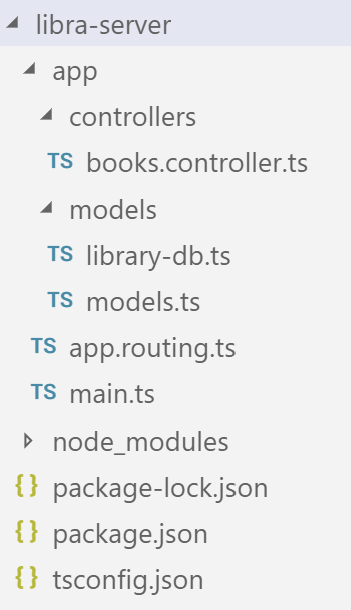

class: center, middle

# Haladó JavaScript
---

# Objektumok
Kulcs-érték tárolók

```js
let o = {
    a: "alma"
};
o.b = "körte";
o["c"] = "dió";
console.log(o.d);
```

```ts
for (let prop in a) {
    // "name", "value", "dió"
}
```

Primitív típusok vs. objektumok

```js
console.log("alma".length);
```

???
asdasdas

---

# Függvények

Meghívható objektumok

```js
function f() { console.log("hello"); }
let g = f;
g();
```

Objektum propertynek értékül adhatók

```js
let a = {
    name: "alma",
    f: function() { console.log("hello");  },
    g() { /* rövidített metódus leírás function nélkül */ }
};
```

---

# Függvények 2

Mivel ezek is objektumok, ezért saját propertykkel is rendelkezhetnek:

```js
function f() { console.log("hello"); }
console.log(f.name);
f.a = "alma";
console.log(f.a); // --> alma
```

---

# Konstruktor függvények
```js
function User(name) {
  this.name = name;
  this.isAdmin = false;
  this.greet = function () { console.log(this.name); }
}

let user = new User("Jack");
```

---

# A `this` működése 

Hogyan kap értéket? 

```js
user.greet()
```

`this` elvesztése:

```js
let f = user.greet; 
f();
```

`this` beállítása:

```js
f.call(thisArg, arg1, arg2, ...);
```
```js
f.bind(thisArg)
```

---
# Lambda kifejezések
```js
function add1(a,b) { return a + b; }
let add2 = function(a, b) { return a + b; }
let add3 = (a,b) => a + b;
let f1 = () => "hello";
let f2 = (a,b,c) => { /*...*/ };
```

---

# Lambda kifejezések 2

A lambda kifejezések nem állítanak be saját `this` kontextust, hanem öröklik

```ts
let user = {
	name : "alma",
	greet() {
		setTimeout(function() {
			console.log(this.name); //undefined
		}, 1000);
		setTimeout(() => {
			console.log(this.name); //alma
		}, 2000);
	}
};
user.greet();
```

---
# Getter / setter

```js
let user = {
	_name : "",
	get name() { return this._name; },
	set name(value) { 
		this._name = value;
		console.log(value);
	}
};
user.name = "alma"; // console --> "alma"
console.log(user.name); // console --> "alma"
```

---
class: center, middle
# Prototípusok

---
# Objektum-orientált JavaScript
* Gyengén típusos nyelv
* Nincsenek osztályok, helyette öröklés
* Propertyk öröklése prototípustól (pl. `toString`)
* Specilális getter/setter: 
    * `__proto__`
    * `Object.getPropertyOf(obj), Object.setPropertyOf(obj)`
    * Igazi property neve: `[[Prototype]]`

```js
let o = {};
console.log(o.toString()); // --> "[object Object]"
console.log('toString' in o.__proto__); // --> true
o.__proto__ = null;
console.log(o.toString()); // --> TypeError: o.toString is not a function
```
---
# Prototípus beállításának szabályai

* Nincs körbeverés (nem lehet ciklus a prototípus öröklésben).
* A protoípusok csak objektumok, vagy `null` lehet, primitív típus nem. 
* A `this` értékét nem befolyásolják

Példa: 
```js
let user = {
	greet() { console.log(this.name); }
};
let admin = { name : "admin" };
admin.__proto__ = user;
admin.greet(); // "admin"
```
---

# Függvények alapértelmezett prototípusa

```js
function User(name) {
	this.name = name;
}
let user = new User();
User.prototype.greet = function () { console.log("hello"); }
user.greet();
```

* Primitív típusok csomagolóosztályai biztosítanak prototípust: `Boolean.prototype, Number.prototype, String.prototype`
* `Array.prototype` és tsai. kiegészítése
    * *polyfill* fogalma

---
# Osztályok

.left-column[
```js
class User {
    name = "";
    greet() { //metódus
        console.log(this.name);
    }
}
```
]
.right-column[
```js
function User () {
    this.name = "";
}
User.prototype.greet = function() {
    console.log(this.name);
}
```
]

Az osztályok rendelkezhetnek konstruktorral is
```js
class User {
    constructor(name) {
        this.name = name;
    }
}
```

---
# Osztályok 2
* `public, protected, private`
* parameter property

```js
class A {
    constuctor(public name ) { }
}
```
* öröklés

```js
class A {  }
class B extends A {
    greet() {
        console.log(super.name);
    }
}
```

---
# Osztályok 3

Osztálykifejezések:

```js
function BFactory() {
    return class { /*...*/ }
}
class A extends BFactory() {

}
```

---
# Tömb osztály 
Fontos függvények és propertyk: `length, filter, map, splice, push, pop, shift, unshift, find...`
```js
let list = [1,2,3,4,5,6,7];
list.push(8); // list = [1,2,3,4,5,6,7,8]
let list2 = list.map(item => item + 1); // [2,3,4,5,6,7,8, 9]
let list3 = list2.filter(item => item < 4); // [2,3]
list.splice(1,3, "a", "b"); // list = [1, "a", "b", 5, 6, 7, 8]
let i = list2.indexOf(4);

let list4 = [{ id: 1, name: "A"}, {id: 2, name: "B"}];
let a = list4.find(item => item.id === 1);
```


---
class: center, middle
# NodeJS
## NPM
## Express JS

---
# JavaScript motorok
* Chrome V8 engine
* SpiderMonkey (Firefox)
* IE, Edge,

| Böngésző | Szerveroldali JS | 
|---|---|
| Speciális változók: `window` |  |
| HTML DOM hozzáférés (`document`) |  |
|  | Speciális erőforrások: pl. File API |

---

# NodeJS projekt
```console
$ npm init
```

`package.json`:
```json
{
  "name": "test-server",
  "version": "1.0.0",
  "description": "",
  "main": "index.js",
  "scripts": {
    "test": "echo \"Error: no test specified\" && exit 1"
  },
  "author": "",
  "license": "ISC"
}
```
---

# `npm`

```console
$ npm install express --save
```

```json
{
    ...
    "dependencies": {
        "express": "^4.16.4"
    }
}
```

---

# Express JS

```js
//index.js
const express = require('express')
const app = express()
const port = 3000
app.get('/', (req, res) => res.send('Hello World!'))
let users = [
    { id: 1, name: "Mark", age: 35 },
    { id: 2, name: "Mari", age: 35 }
];
app.get('/users', (req, res) => {
    res.send(users);
});
app.get('/users/:id', (req, res) => {
    let user = users.find(u => u.id == req.params.id); //==, vagy === parseInt()
    res.send(user);
});
app.listen(port, () => console.log(`Example app listening on port ${port}!`))
```

---

# Futtatás

```console
$ node index.js
Example app listening on port 3000!
```

Tesztelés böngészőben

`http://localhost:3000/`

```
Hello World!
```

`http://localhost:3000/users`

```json
[{"id":1,"name":"Mark","age":35},{"id":2,"name":"Mari","age":35}]
```

`http://localhost:3000/user/1`

```json
{"id":1,"name":"Mark","age":35}
```


---

class: center, middle
# Typescript

---

## Bevezetés

* JavaScriptScript verziók és az ECMAScript
    * ES3
    * ES5 (2009), ES5.1 (2011.-12.)
    * ES6 (ES2015) (cél, egy általános célú programozási nyelv)
    * ES7 (ES2016), ES8 (ES2017) (async), ES9 (ES2018)
* JavaScript motorok
* **Transpiler**: source-to-source compiler
    * Babel
    * CoffeeScript

---
# TypeScript
* Mi az a TS? (TS > JS?)
* Miért van/volt szükség a TypeScript-re?
* *típusannotációk*: típus megkötések hozzáfűzése az egyes nevekhez automatizáltan és manuálisan

```ts
function(a : number, b : number) {
    return a + b;
}
let numbers = [1,2,3,4];
```


* TS fordítás és végrehajtás folyamata
    * először JS-t kell generálni: 

```console
$ tsc valami.ts
$ node valami.js
```
---

# Típusok

`boolean` 

```ts
let x : boolean;
```

`number` 

```ts 
let x : number = 5;
```

`string` 

```ts
let x : string = 'alma';
```
---
#Típusok 2

tömbök: `[]`, `number[]`, `string[]` 

```ts
let a : number[];
let b : any[];
```

ennesek 

```ts
let a : [number, string];
//a[0] : number
//a[1] : string
```

`enum`

```ts
enum Color { Red, Green, Blue }
```


---
# Típusok 3

`any`: tetszőleges objektum, ugyanaz, mintha nem adnánk meg semmit
`void`: visszartérési érték nélküli függvény
*type assertation*: 

```ts
let x : any;
let a = <number>x;
let b = x as number;
```

* Ez nem cast-olás, nem történik átalakítás JavaScript-ben, csak azt mondjuk a TS fordítónak, hogy ezt mostantól ilyen típusként kezelje

Saját típusdeklaráció: 

```ts
let user: { name: string, greet : () => void };
//user.name
//user.greet()
```
---

# Változók

Példák változók típusdefiníciókkal történő ellátására

```ts
let a : string;
let b = 5; //number
let c =  a; // string;
b = "alma"; // fordítás idejű hiba
let d : { name: string} = { name: "alma", value: "körte"};
```

További fontos tulajdonságok:
* `var, let, const` használhatók
* rendes block scoping 

---

# Interfészek

* `: { ... }`, mint intefész lehetőség
* `interface` kulcsszóval elnevezhetők és újrafelhasználhatók
* öröklés interfészek között (`extends`)
* opcionális mezők: `{ name? : string }`
* `readonly` property-k (csak létrehozáskor adhatók meg, később nem módosíthatók)

```ts
interface Point {
    readonly x: number;
    readonly y: number;
}
let p1: Point = { x: 10, y: 20 };
p1.x = 5; // error!
```

---
#Interfészek 2

* *index signature*: 

```ts
interface SquareConfig {
    color?: string;
    width?: number;
    [propName: string]: any; //az index lehet string, vagy number
}   
```

Függvény típusok leírása intefészekkel

```ts
interface SearchFunc {
    (source: string, subString: string): boolean;
}
```

* a paraméternevek nem kell majd egyezzenek

---

# Osztályok

* `class`
* `constructor` (paraméter property-k működnek)
* `extends` - öröklés másik osztályból
* `implements` -  interfész implementálás
* módosítók: `public`, `private`, `protected`, `static`, `readonly`
* getter, setter
* `abstract` - nem példányosítható
---

# Osztályok 2

```ts
interface IAnimal {
    name : string;
}
class Mammal implements IAnimal {
    constructor(public name : string) {  }
    public age : number;
    public move() { }
    private numberOfLegs : number;
}
class Dog extends Mammal {
    constructor(name : string) {
        super(name);
    }
    public bark() { }
}
```

---

# Osztályok 3

Óvatosan az osztályokkal és példányaikkal 
 * Mindig példány lesz?
 * Típusannotáció vs. cast

```ts
class A {
    a : string;
}
let user : A = { a: "alma" }; //lefordul, de nem lesz példány az A-nak
```
    
???
 forgatókönyv, amikor a szerver visszaad egy JSON-t, amit parse-olunk. 

---
# TypeScript &rarr; JavaScript

.left-column[
```ts
let a : number;
a = 5;

interface IUser {
	name: string;
	age?: number;
}

class User implements IUser {
	constructor(public name: string) {
    }
    
	greet() {
		console.log(this.name);
    }
    
	favoriteColor: string;
}

let user = new User("Mari");
```
]
.right-column[
```js
var a;
a = 5;
var User = /** @class */ (function () {
    function User(name) {
        this.name = name;
    }
    User.prototype.greet = function () {
        console.log(this.name);
    };
    return User;
}());
var user = new User("Mari");
```
]

---

# Függvények

```ts
let myAdd: (x: number, y: number) => number = //típudefiníció
    function(x: number, y: number): number { return x + y; };
```

* opcionális (`?`) és default paraméterek (`=`)

```ts
function f(a? : number) {

}
f();
f(1);

function g(a : number = 5) {

}
g();
g(6);
```
* `this`: ugyanaz igaz rá, mint JavaScriptben

---

# Generikus típusparaméterek

```ts
function identity<T>(arg: T): T {
    return arg;
}
```

```ts
function loggingIdentity<T>(arg: Array<T>): Array<T> {
    console.log(arg.length);  // Array has a .length, so no more error
    return arg;
}
```

.left-column[
```ts
interface A<T1, T2> {
    value1: T1;
    value2: T2;
}
```
]
.right-column[
```ts
class C<T1, T2> {
    constructor(public a: T1) {

    }
    public b: T2;
}
```
]
---

# Generikus típusparaméterek 2

Típuskényszerek a generikus paraméteren: 
```ts
function loggingIdentity<T extends Lengthwise>(arg: T): T {
    console.log(arg.length);  // ok
    return arg;
}
```

---

# Típusok kombinálása
* intersection (metszet): 

```ts
let user: Person & Administrator;
```

* union (unió): 

```ts
let item: string | number;
```

---

# Típusok kombinálása 2

Honnan tudjuk, hogy mi lesz benne? Elég a castolás? (nem):
.left-column[
```ts
class A {
    a: string;
}
class B {
    b: string;
}
function (item: A | B) {
    if ((<A>item).a) {
        //a
    }
    if ((<B>item).b) {
        //b
    }
}
```
]
.right-column[
```ts
interface A {
    a : string;
}
interface B {
    b: string;
}
function isA(item: any) : item is A {
    let a = (<A>item).a;
    return a !== undefined;
}
function f(item: any) {
    if (isA(item)) {
        item.a = 'alma';
    }
}
```
]

---

# További típusok

*literal* típus: 

```ts
let item: 'a' | 'b' | 'c' | 3 | 5 | User;
```

Lehet-e `null` egy változó értéke (*nullable*)?  (`--strictNullChecks`)

```ts
let x : number = null;
let y : number | null = null;
```

`type` alias: 

```ts
type MyMethod = (x) => void
```

* `type` vs `interface`: 
    * `type` neve nem jelenik meg
    * nem lehet benne `extend, implements` utasításokban
    * tartalmazhat unió és metszet típusokat

---
# `keyof`


```ts
let a : keyof Person;
```

```ts
function getProperty<T, K extends keyof T>(o: T, name: K): T[K] {
    return o[name]; // o[name] is of type T[K]
}
```

---

# Modulok 
 `export` / `import` (már JavaScriptben is vannak)

```ts
//file1.ts
export function f() { }
```

```ts
//file2.ts
import * from 'file1';
import { f } from 'file1';
```

* vs. *require js*

---
# Névterek 
Névterek (`namespace`)

```ts
namespace Test1 {
    export class A {  }
    class B {  }
}

namespace Test2 {
	export class C { }
	class D { }
}

let x : Test1.A;
```

---

# Declaration files (.d.ts)

* Együttműködés nem TypeScript könyvtárakkal: 
* `declare`: `var, function, namespace` 
* függvényeket lehet overloadolni

```ts
declare namespace GreetingLib.Options {
    // Refer to via GreetingLib.Options.Log
    interface Log {
        verbose?: boolean;
    }
    interface Alert {
        modal: boolean;
        title?: string;
        color?: string;
    }
}
declare f(x: number) => void;
declare f(y: string) => void;
```

---

# Dekorátorok osztályokon

```ts
function log(target: any) {
	console.log(target.name);
}

@log
class A { } // --> A
```

```ts
function providesHello(target: any) {
	target.prototype.hello = function() {
		console.log('hello');
	}
}

@providesHello
class A { }
let a= new A();
(<any>a).hello(); //castolás nélkül nem megy
```

---
# Dekorátorok függvényeken

```ts
function info(target: any, propertyKey: string, descriptor: PropertyDescriptor) {
	console.log(propertyKey);
}

class A {
	@info
	f() { }
}
```
---

# Dekorátor *factory*

```ts
function info(writeToConsole: boolean) {
    return function info(target: any, propertyKey: string, 
                         descriptor: PropertyDescriptor) {
		if (writeToConsole)
			console.log(propertyKey);
	}
}
class A {
	@info(true)
	f() { }
	@info(false)
	g() { }
}
```

---

# Project kezelés (`tsconfig.json`)


```json
{
    "compilerOptions": {
        "outFile": "../../built/local/tsc.js",
        "sourceMap": true
        //...
    },
    "compileOnSave": true,
    "include": [
        "src/**/*"
    ],
    "exclude": [
        "node_modules",
        "**/*.spec.ts"
    ],
    "files": []
}
```

*(És még sok egyéb)*

---

# TypeScript értékelés

"JavaScript Development at Application Scale"
* Típusok &rarr; kevesebb hiba
* Modularlizáltság
* Fejlesztőeszközök (Visual Studio, VSCode, WebStorm etc) 
    * kódkiemelés
    * autocomplete

---

class: center, middle
#LIBRA
Példa könyvadatbázis 
## szerveralkalmazás
---

# Projekt létrehozás

```console
$ npm init
```

&rarr; `package.json`

```console
$ npm install typescript -s
```

&rarr; `node_modules` mappa

&rarr; `package.json` kiegészítés

```json
{
  //...
  "dependencies": {
    "typescript": "^3.4.4"
  }
  //...
}
```

---
# Projekt létrehozás 2

```console
$ tsc --init
```

&rarr; `tsconfig.json`:

```json
{
    //...
    "target": "es5",                          
    "module": "commonjs",                     
    //...
}
```

`tsconfig.json` kiegészítése:

```json
{
    "outDir": "./build",
    "target": "es6"              
}
```

---

# Express JS types

`npm` csomagok és típusdefiníciók TypeScriptben
```console
$ npm install express -s
```

```console
$ npm install @types/express -s
```

&rarr; `node_modules/@types/express/index.d.ts`

---
# Könyvtárszerkezet



---
# Adatmodell

`models.ts`

```ts
export interface IBook {
    title : string;
    isbn : string;
}
```
---

# Adatelérési réteg

`library-db.ts`

```ts
import { IBook } from "./models";

const initialBooks: IBook[] = [
    { isbn: "9786155248214", title: "Egri csillagok" }
    , { isbn: "9789639555054", title: "A kőszívű ember fiai" }
    , { isbn: "9789630980746", title: "Fekete gyémántok" }
];
```

---
# Adatelérési réteg 2

`library-db.ts`

```ts
export class LibraryDB {
    private books: IBook[] = [];

    public getBookByISBN(isbn: string): IBook | null { /*...*/ }
    public getAllBooks(): IBook[] { /*...*/ }
    public deleteBook(isbn: string) : void { /*...*/ }
    public updateBook(book: IBook) : void { /*...*/ }
    public createBook(isbn: string, title: string) : void { /*...*/ }

    public reloadDB() : void {
        this.books = [...initialBooks];
    }
}
```

---
# Controller

`books.controller.ts`

```ts
import { LibraryDB } from "../models/library-db";
import { IBook } from "../models/models";

export class BooksController {
    constructor(private db : LibraryDB) {  }
    public getBookByISBN(isbn: string): IBook | null {
        return this.db.getBookByISBN(isbn);
    }
    public getAllBooks(): IBook[] { return this.db.getAllBooks(); }
    public deleteBook(isbn: string) { this.db.deleteBook(isbn); }
    public updateBook(book: IBook) { this.db.updateBook(book); }
    public createBook(isbn: string, title: string) { 
        this.db.createBook(isbn, title); 
    }
}
```
Mi a különbség a controller és a db osztály között?

---

# Express JS routing

`app.routing.ts`

```ts
import express from 'express';
import { BooksController } from './controllers/books.controller';
import { IBook } from './models/models';

export function configureRouting(app: express.Application, 
                                 booksController: BooksController) {

    app.get('/', (req, res) => res.send('Libra server'));

    app.get('/books', (req, res) => {
        console.log('get books');
        res.json(booksController.getAllBooks())
    });
    app.get('/books/:isbn', (req, res) => { /*...*/ });
    app.post('/books', (req, res) => { /*...*/ });
    app.put('/books/:isbn', (req, res) => { /*...*/ });
    app.delete('/books/:isbn', (req, res) => { /*...*/ });
}
```

---
# Bootstrapper

`main.ts`
```ts
import express from 'express';
import { LibraryDB } from './models/library-db';
import { BooksController } from './controllers/books.controller';
import { IBook } from './models/models';
import { configureRouting } from './app.routing';

// Create a new express application instance
const app: express.Application = express();
const db = new LibraryDB();
db.reloadDB();
const booksController = new BooksController(db);

configureRouting(app, booksController);

app.listen(3000, function () {
  console.log('Libra server listening on port 3000!');
});
```


---
# Fordítás és futtatás

```console
$ tsc
```

```console
$ node .\build\app.js
```

Vagy: 
* `package.json`

```json
{
  //...
  "scripts": {
    "serve": "tsc && node ./build/main.js"
  },
  //...
}
```

* `$ npm run serve`
